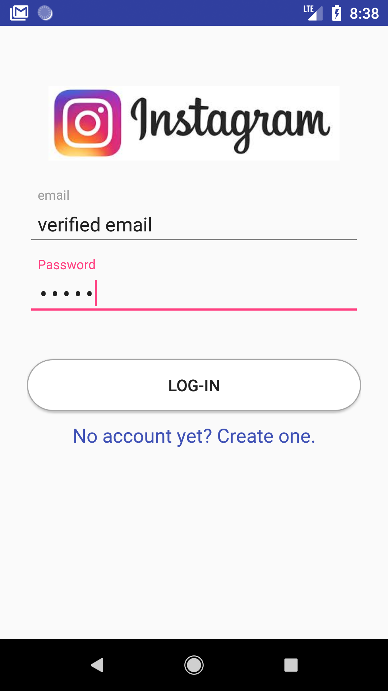
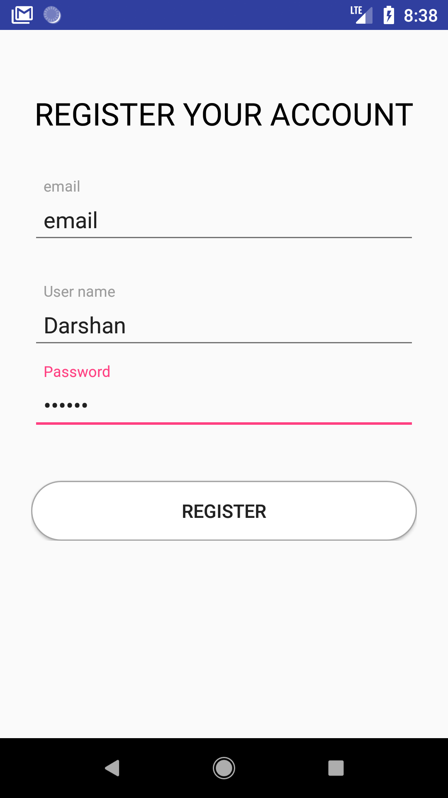

# Instagram_clone

 App with all basic features of Instagram.
 
## Included features 
1.	Account settings - Sign up, Email verification, Sign in with verified email. 
2.	Main feed to display all photos posted by user, and from people followed by user.
   Can like and comment on the photo. Can take photo using Camera and post it.
   Chat with people in contact list.
3.	Search feed to search any registered users, using auto completed user name. 
   Can choose to follow or un-follow the selected user.
4.	Share feed where user can find photos to share from their device memory. 
   Or can take photo and then share the selected photo with caption.
5.	Profile feed to keep track of user activity in app. 
   Here user can change profile photo, authenticated user name, personal info or can opts to Log out.
     
### Account settings

  
   

 
   When user first sign up, he has to provide his email to register. Using FireBase authentication we can verify for exiting email, if the enterd email is not already registered in our authenticated user list. We will send the confirmation email to the entered email address. User can sign-in only if he already verfied the email. 
   

### Main feed

  
   

 

