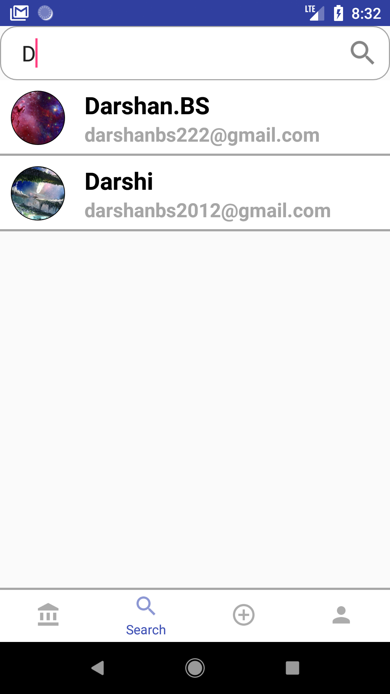
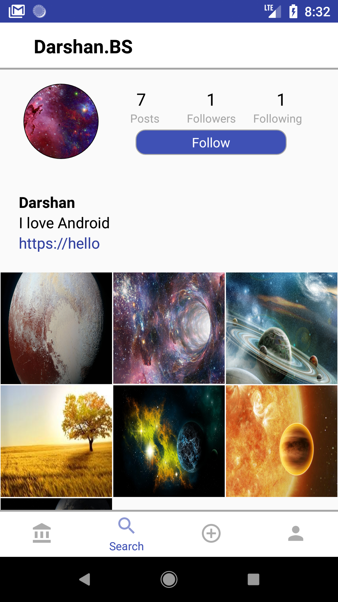
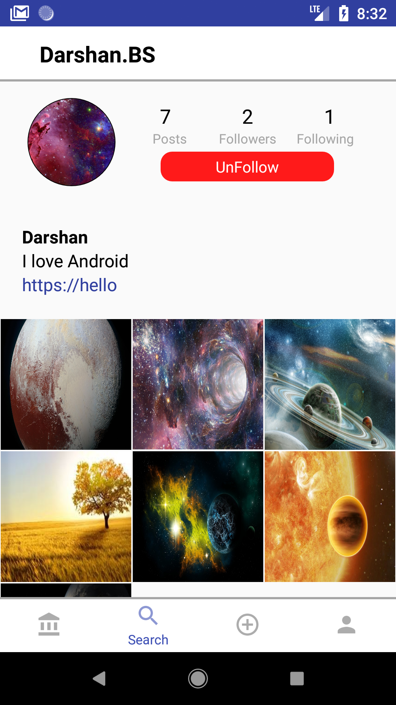
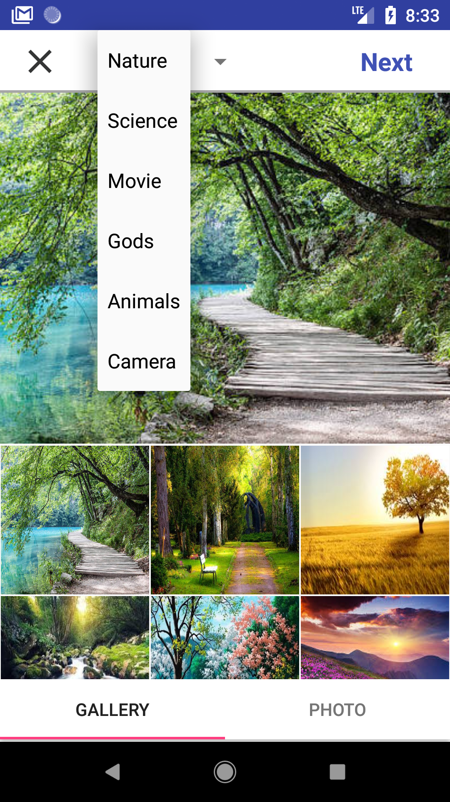
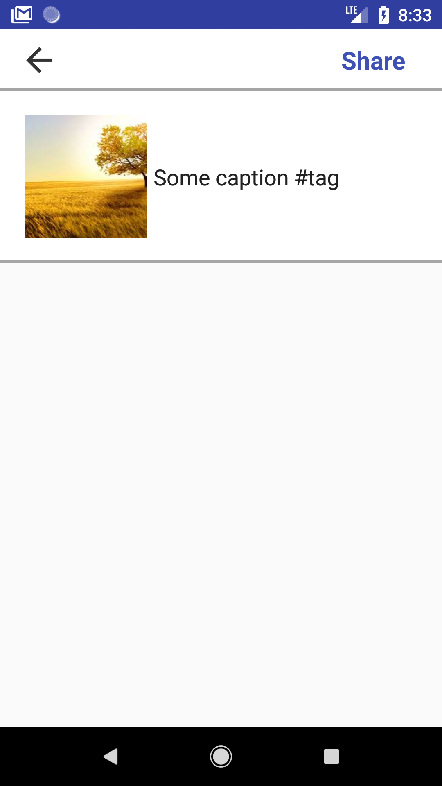
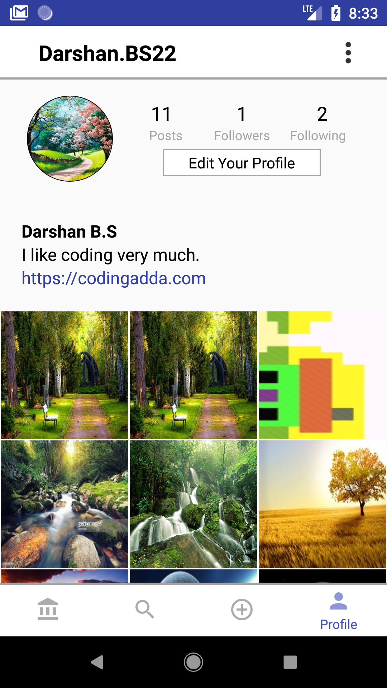
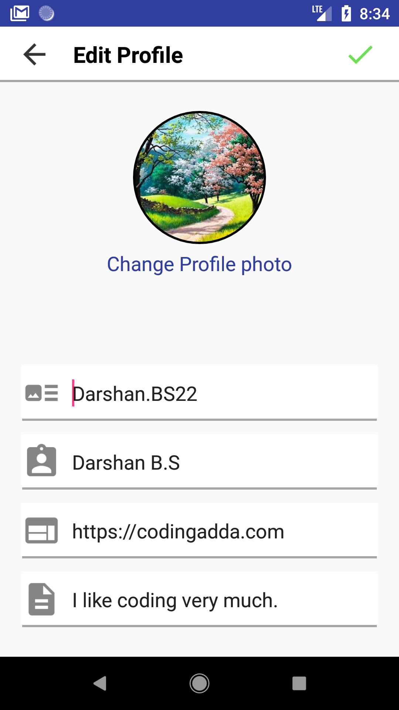
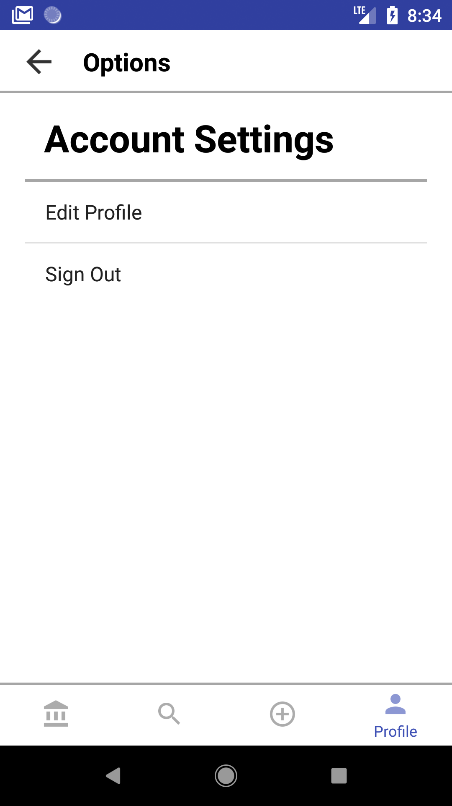

# Instagram_clone

 App with all basic features of Instagram.
 
## Included features 
1.	Account settings - Sign up, Email verification, Sign in with verified email. 
2.	Main feed to display all photos posted by user, and from people followed by user.
   Can like and comment on the photo. Can take photo using Camera and post it.
   Chat with people in contact list.
3.	Search feed to search any registered users, using auto completed user name. 
   Can choose to follow or un-follow the selected user.
4.	Share feed where user can find photos to share from their device memory. 
   Or can take photo and then share the selected photo with caption.
5.	Profile feed to keep track of user activity in app. 
   Here user can change profile photo, authenticated user name, personal info or can opts to Log out.  
  
 
### 1. Account settings

  
   

 
When user first sign up, he has to provide his email to register. Using FireBase authentication we can verify for exiting email, if the enterd email is not already registered in our authenticated user list. We will send the confirmation email to the entered email address. User can sign-in only if he already verfied the email. 
  

### 2. Main feed

  
   
  

Main feed displays all the photos posted by current user, and by all the users followed by current users.
 Top label of user name and profile photo, displays image posted user info.
 User can like the photo by clicking on heart icon. or can comment on photo by clicking on comment bubble icon. 
 

   
  

User can also take photo and share it with others.
 User can chat with mutually(user1 follows user2, user2 also follow user1) followed users.
  

### 3. Search feed

   
  
  

User can searh for any other registered users, by typing registerd user's user name. 
 Current user can opt to follow/un-follow the search result user.
  

### 4. Share feed

   
  

User can select photos from device memory(from DCIM/Camera folders), or can take new photo by camera.
And then share it by writing some caption.
  

### 5. Profile feed

   
  
  

Profile feed keep track of all the user activities, like number of photos shared, number of followers, following users.
 User can change their profile photo. Or can edit their personal information here.
 Here user can sign-out from the app.

